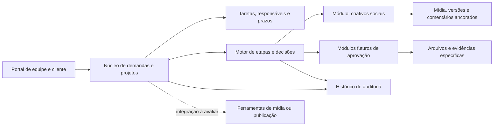
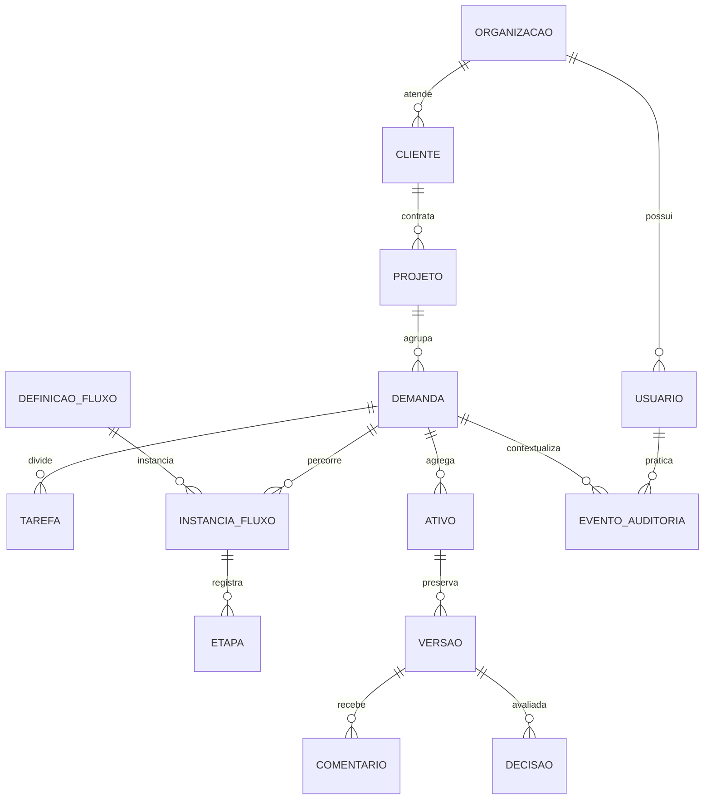

# Proposta inicial de arquitetura de produto

**Estado:** recomendação de produto para orientar o protótipo; tecnologias, hospedagem e arquitetura técnica ainda não foram escolhidas.

## Direção

Construir a plataforma como um núcleo de gestão de trabalho com módulos de processo/aprovação. O núcleo identifica a demanda, cliente/projeto, participantes, tarefas, prazos, arquivos, versões e histórico. Cada módulo configura seu tipo de processo, etapas, formulários, permissões e decisões. Assim, aprovação de criativos é o primeiro módulo, e outras áreas podem entrar sem criar outro cadastro ou outro histórico paralelo.

## Responsabilidades do produto

- **Núcleo de trabalho:** cadastro da demanda, contexto do cliente, tarefas, atribuições, estimativas, prazo, bloqueios e visões de quadro/lista.
- **Fluxo configurável:** estados e transições, condições para avançar, aprovadores, prazos de resposta e exceções autorizadas. A primeira configuração implementa o fluxo-alvo aprovado; o caso real confirma atores, variações e exceções da operação.
- **Módulo de criativos:** arquivo submetido e suas versões; comentário geral ou ancorado; timecode para vídeo; revisão interna antes do envio ao cliente, conforme fluxo-alvo aprovado; decisões de aprovar ou solicitar alterações.
- **Trilha de auditoria:** ator, ação, objeto, versão e horário para alterações de briefing, atribuições, comentários, decisões e encerramento.
- **Integrações:** avaliar separadamente armazenamento de arquivos, revisão especializada, publicação social, calendário e notificações. A plataforma central conserva o vínculo, o estado e a evidência necessária para compreender o processo.
- **IA assistiva:** preparar sugestões de tarefas, responsáveis e estimativas em rascunho. Uma pessoa precisa revisar e confirmar; a aplicação registra o que foi aceito ou alterado.

## Modelo conceitual de dados

Este é um vocabulário de produto para orientar requisitos e protótipo; não é ainda um esquema de banco de dados. Os nomes e relações serão validados com a operação real antes de definir tabelas, chaves ou tecnologia.

| Conceito | Responsabilidade | Relações principais |
| --- | --- | --- |
| **Organização** | Espaço operacional da Mix7 e sua configuração. | Tem clientes, usuários internos, papéis e projetos. |
| **Cliente** | Entidade externa atendida pela agência. | Tem contatos externos e projetos; seus usuários só acessam o conteúdo explicitamente compartilhado. |
| **Projeto** | Contexto de trabalho contínuo ou campanha para um cliente. | Agrupa demandas; tem responsáveis internos e regras aplicáveis. |
| **Demanda** | Unidade central de trabalho, com solicitante, briefing, prazo e estado geral. | Pertence a um projeto; origina tarefas e instâncias de fluxo; agrega arquivos, decisões e histórico. |
| **Tarefa** | Trabalho atribuível, com responsável, prazo, estado e estimativa opcional. | Pertence a uma demanda; pode ser organizada em rodadas de execução ou ajuste. |
| **Definição de fluxo** | Modelo versionado de etapas, transições, condições e papéis para um tipo de processo. | Uma instância de fluxo referencia a definição e sua versão; módulos podem acrescentar campos próprios. |
| **Instância de fluxo / etapa** | Execução concreta de uma definição para uma demanda. | Registra etapa atual, entradas, saídas, responsáveis e transições realizadas. |
| **Ativo / versão** | Arquivo ou ligação submetida como evidência de trabalho. Cada nova entrega gera uma versão preservada. | Vincula-se à demanda e pode ser alvo de comentários, revisões e decisões; versões antigas não são sobrescritas. |
| **Comentário** | Observação geral ou apontamento a uma região/timecode de um ativo. | Guarda autor, versão exata, âncora quando aplicável e estado de resolução. |
| **Revisão / decisão** | Resposta de um revisor autorizado para uma versão ou etapa. | Guarda resultado, comentário opcional, autor, data e versão; aprovação de cliente não representa por si só publicação ou entrega. |
| **Evento de auditoria** | Registro imutável de uma ação relevante e seu contexto. | Referencia ator, ação, objeto, horário e dados de correlação; alterações de estado e permissões devem ser rastreáveis. |
| **Sugestão de IA** | Proposta gerada para briefing, tarefas, responsáveis ou estimativas. | Mantém conteúdo proposto e estado (pendente, aceita, editada ou rejeitada), autor de confirmação e vínculo ao processo; nunca aplica mudanças sem confirmação humana. |

Regras transversais propostas: separar identidade da pessoa de sua participação em uma organização; validar autorização no servidor para cada recurso; manter cliente e organização como limites de acesso; preservar autoria e histórico; guardar arquivos fora dos registros transacionais com identificador estável e controle de acesso; e separar estados comuns do núcleo dos campos específicos de cada módulo. A estratégia concreta de isolamento, retenção, exclusão e recuperação depende de volume, contrato e exigências legais ainda não levantados.

## Contratos entre módulos

O núcleo deve fornecer a demanda, cliente/projeto, identidade, permissões, tarefas, prazos e trilha de auditoria. Um módulo declara seu tipo de solicitação, formulário, etapas, decisões válidas e evidências exigidas. A experiência de revisão de criativos pode expor versões e âncoras visuais/timecode; outro módulo pode exigir documentos ou campos diferentes. Ambos chamam o mesmo mecanismo autorizado de transição e gravam eventos no histórico central.

Uma integração externa deve trocar identificadores e eventos por uma interface explicitamente versionada; precisa ser possível reconciliar falhas e evitar a criação duplicada da mesma demanda. A integração não deve ser a única cópia da decisão final: o núcleo mantém referência exportável à evidência e ao estado resultante. API, webhooks, armazenamento e estratégia de reconciliação permanecem escolhas técnicas em aberto.

O diagrama expressa relações conceituais e pode mudar após mapear pedidos recorrentes, múltiplas marcas/clientes, participantes externos, guarda de mídia e as regras reais de revisão.

## Limites para a primeira entrega

O primeiro recorte deve comprovar uma demanda social do início ao registro final. Avaliação de desempenho, treinamento, matriz de acesso a serviços, automações amplas e publicação automática não bloqueiam o protótipo desse fluxo. Eles permanecem no mapa do produto e avançam depois de especificados. Não guardar senhas de redes sociais no primeiro recorte; qualquer gestão de credenciais exige análise de segurança própria.

## Decisões técnicas ainda pendentes

Não escolher frontend, backend, banco de dados, hospedagem ou provedor de arquivos antes de comparar manutenção, segurança, exportação, integrações e custo e validar a operação real. A pesquisa está em [PESQUISA-SOLUCOES.md](PESQUISA-SOLUCOES.md); o cenário e os critérios da prova controlada estão em [PROVA-DE-CONCEITO.md](PROVA-DE-CONCEITO.md). Testar interfaces e integrações antes de fixar tecnologia. Esta arquitetura de produto define conceitos e contratos, mas não a arquitetura técnica, implantação ou desenho físico do banco.

## Critério de evolução desta proposta

Detalhar esta arquitetura quando a validação trouxer: atores e exceções reais; tipos de arquivo e volume; regra de acesso de clientes; evidências específicas por serviço; integrações exigidas; e limite orçamentário/operacional. A estrutura do fluxo-alvo aprovado só deve ser revista com nova evidência ou decisão explícita; sua aprovação não confirma como a operação trabalha hoje.
