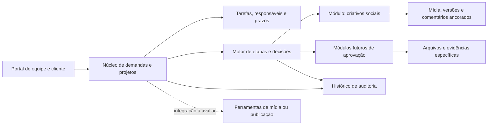

# Proposta inicial de arquitetura de produto

**Estado:** recomendação de produto para orientar o protótipo; tecnologias, hospedagem e arquitetura técnica ainda não foram escolhidas.

## Direção

Construir a plataforma como um núcleo de gestão de trabalho com módulos de processo/aprovação. O núcleo identifica a demanda, cliente/projeto, participantes, tarefas, prazos, arquivos, versões e histórico. Cada módulo configura seu tipo de processo, etapas, formulários, permissões e decisões. Assim, aprovação de criativos é o primeiro módulo, e outras áreas podem entrar sem criar outro cadastro ou outro histórico paralelo.

## Responsabilidades do produto

- **Núcleo de trabalho:** cadastro da demanda, contexto do cliente, tarefas, atribuições, estimativas, prazo, bloqueios e visões de quadro/lista.
- **Fluxo configurável:** estados e transições, condições para avançar, aprovadores, prazos de resposta e exceções autorizadas. A primeira configuração segue o fluxo aprovado como alvo, ainda sujeito à validação do caso real.
- **Módulo de criativos:** arquivo submetido e suas versões; comentário geral ou ancorado; timecode para vídeo; revisão interna quando confirmada; decisões de aprovar ou solicitar alterações.
- **Trilha de auditoria:** ator, ação, objeto, versão e horário para alterações de briefing, atribuições, comentários, decisões e encerramento.
- **Integrações:** avaliar separadamente armazenamento de arquivos, revisão especializada, publicação social, calendário e notificações. A plataforma central conserva o vínculo, o estado e a evidência necessária para compreender o processo.
- **IA assistiva:** preparar sugestões de tarefas, responsáveis e estimativas em rascunho. Uma pessoa precisa revisar e confirmar; a aplicação registra o que foi aceito ou alterado.

## Limites para a primeira entrega

O primeiro recorte deve comprovar uma demanda social do início ao registro final. Avaliação de desempenho, treinamento, matriz de acesso a serviços, automações amplas e publicação automática não bloqueiam o protótipo desse fluxo. Eles permanecem no mapa do produto e avançam depois de especificados. Não guardar senhas de redes sociais no primeiro recorte; qualquer gestão de credenciais exige análise de segurança própria.

## Decisões técnicas ainda pendentes

Não escolher frontend, backend, banco de dados, hospedagem ou provedor de arquivos antes de comparar manutenção, segurança, exportação, integrações e custo e validar a operação real. A pesquisa inicial está em [PESQUISA-SOLUCOES.md](PESQUISA-SOLUCOES.md). A recomendação é testar interfaces e integrações com uma prova de conceito antes de fixar tecnologia.

## Critério de evolução desta proposta

Rever esta arquitetura quando a validação trouxer: fluxo real com exceções; papéis concretos; tipos de arquivo e volume; regra de acesso de clientes; critério de conclusão; integrações exigidas; e limite orçamentário/operacional. A aprovação desta proposta de fluxo é uma diretriz do produto, não confirmação de como a operação trabalha hoje.
